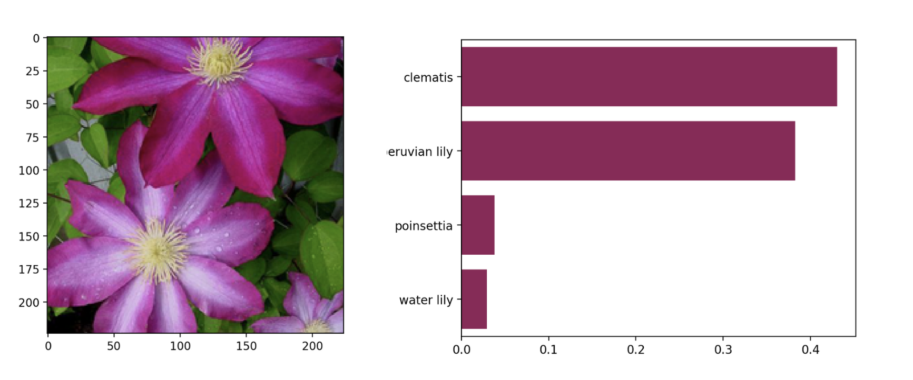
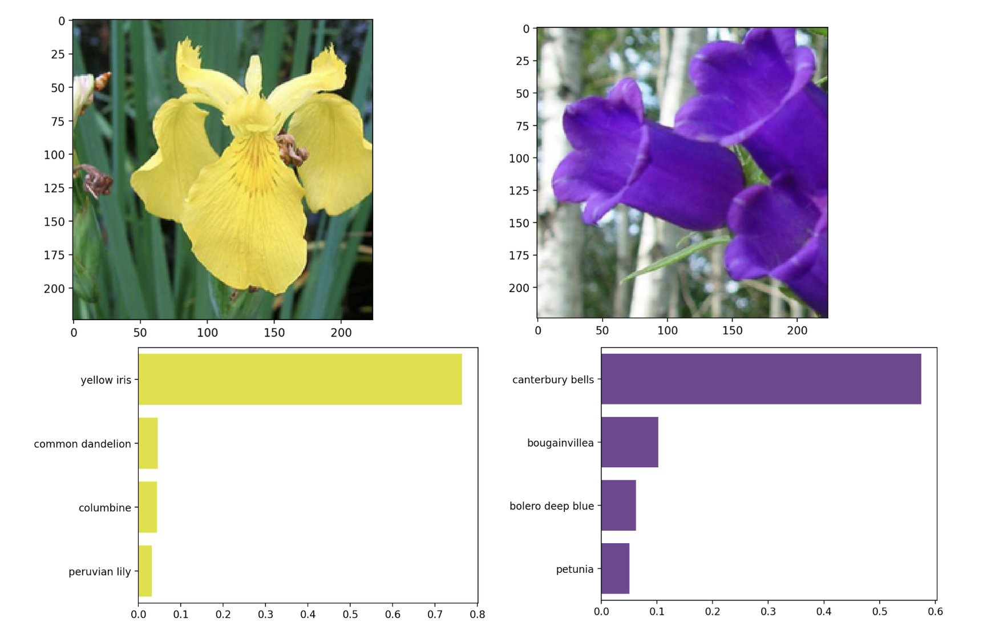

# 🌸 Flower_Recognition_System
This project classifies 102 types of flowers using the AlexNet model. Taking any flower (of the 102 types) the model will predict the top k classes the flower can belong to with probabilities of each class.

  

## Dataset
The project uses the <a href="https://www.kaggle.com/datasets/nunenuh/pytorch-challange-flower-dataset">Oxford 102 Flower Dataset</a>. The dataset has been split into train, test, and validation directories. The train directory has further 102 folders, labeled 1 - 102, each holding 40-65 images of each class of flowers. To identify the class name of each flower, a cat_to_name.json file is present, mapping the flower names to the numbers with which the images are labeled.

## Model - AlexNet
AlexNet is a deep convolutional neural network (CNN) architecture introduced by Alex Krizhevsky. AlexNet consists of eight layers, including five convolutional layers and three fully connected layers, utilizing ReLU activation, dropout for regularization, and overlapping max pooling. It was one of the first models to effectively leverage GPUs for training, making deep learning more practical and efficient.

### Why I Chose AlexNet for Flower Classification:
I chose AlexNet for my flower classification model because it served as a strong starting point for my knowledge at the time. Given its historical significance in computer vision and its relatively simple yet effective architecture, AlexNet provided an excellent foundation for understanding convolutional networks. 

#

I tried the model a few times, and it seemed that 7 epochs gave good results. I did not have access to any form of GPU at the time. In fact, I used my machine's CPU to train it. The GPU of Google Colab could have been utilized, but I wasn't aware of this. This project was for my first AI class.

## Results

  

